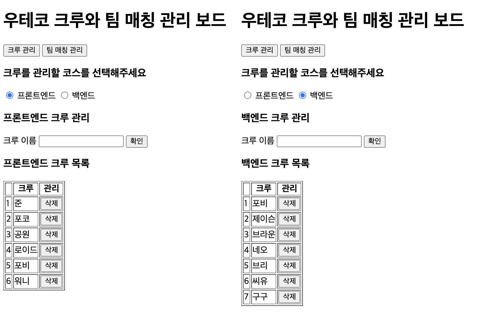
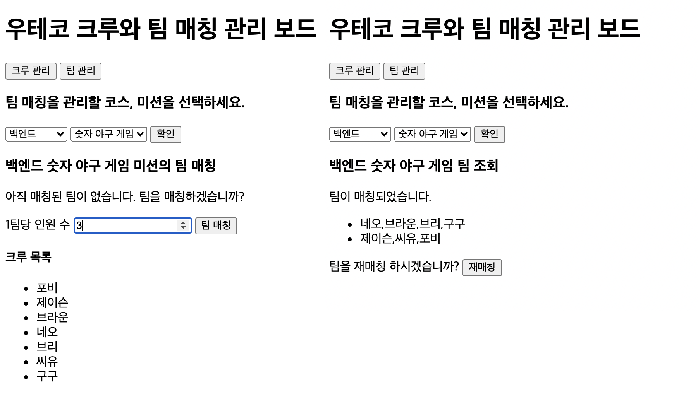

<p align="middle" >
  
</p>
<h1 align="middle">우아한테크코스 크루 관리 & 팀 매칭</h1>

## ☝🏼 개념 설명

**`코스`** : 우아한테크코스는 프론트엔드 코스와 백엔드 코스로 구성되어있다.

**`크루`** : 학생들은 크루라고 호칭한다. 

**`미션`** : 각 코스 별로 크루들이 진행할 미션이 있다. 

**`팀`** : 미션마다 각 코스별 크루들로만 구성된 팀을 매칭할 수 있다. 

이 앱은 코스별로 크루들을 관리하고, 코스별 미션마다 팀을 매칭한다.

## 🎯 기능 요구사항

### 1) 공통

상단에 `탭` 메뉴가 존재하며 각 탭에 따라 적절한 기능을 수행한다.

- `크루 관리` 탭은 크루를 추가하거나 삭제하기 위한 기능을 수행한다.
- `팀 매칭 관리` 탭은 팀 매칭을 하기 위한 기능을 수행한다.
- 다른 탭으로 이동했다 돌아와도 기존 탭의 상태가 유지되어야 한다.
- localStorage를 이용하여, 새로고침하더라도 가장 최근에 작업한 정보들을 불러올 수 있도록 한다.

### 2) 크루 관리 기능 탭

`크루 관리` 탭에서, 다음과 같은 규칙으로 크루를 추가하거나 삭제할 수 있다.

- 코스별로 크루를 추가할 수 있다.
  - 동일한 이름의 크루는 추가할 수 없다.
  - 크루 이름은 최대 5글자까지 가능하다.
- 코스별로 크루를 삭제할 수 있다.
  - 삭제할 때는 [confirm](https://developer.mozilla.org/ko/docs/Web/API/Window/confirm)을 사용하여, 사용자가 한번 더 확인할 수 있게 한다.
- 크루 table의 첫번째 열에는 index를 넣어 순서를 표시한다. index는 '1'부터 시작한다.

### 3) 팀 매칭 관리 기능

`팀 매칭 관리` 탭에서, 다음과 같은 규칙으로 팀을 매칭할 수 있다.

- '코스별' '미션'마다 '무작위로' 팀을 매칭할 수 있다.
  - 예를 들어 프론트엔드의 숫자 야구 게임 미션은 프론트엔드 크루들로만 무작위로 팀이 매칭되고, 백엔드의 숫자 야구 게임 미션은 백엔드 크루들로만 무작위로 팀이 매칭된다.
- 팀 매칭 시 `1팀당 인원 수` 에 입력한 값 보다 더 적은 수의 크루들로 구성된 팀이 없어야 한다. 남은 인원은 앞 팀부터 순서대로 배정한다.
  - 예를 들어, 크루가 11명일 때 `1팀당 인원 수`로 3명을 입력 하면, **4 4 3**으로 팀이 구성되어야 한다.
  - 팀은 재매칭할 수 있다.
- 팀 매칭 결과는 프로그램 실행 결과 예시와 같이 쉼표로 구분한다.

---

## 💻 프로그램 실행 결과

### 1) 크루 관리




### 2) 팀 매칭 관리




---

## ✅ 프로그래밍 요구사항

### 마크업
- 제공하는 아래의 마크업을 활용하여 프로그램을 구현한다.

#### 크루 관리

```html
<div id="app">
  <header>
    <h1>우테코 크루와 팀 매칭 관리 보드</h1>
    <nav>
      <ul>
        <li>
          <button>크루 관리</button>
        </li>
        <li>
          <button>팀 매칭 관리</button>
        </li>
      </ul>
    </nav>
  </header>
  <main>
    <section>
      <h3>크루를 관리할 코스를 선택해주세요</h3>
      <div>
        <input type="radio" name="course" value="frontend" />
        <label for="frontend">프론트엔드</label>
        <input type="radio" name="course" value="backend" />
        <label for="backend">백엔드</label>
      </div>
    </section>
    <section>
      <h3>프론트엔드 크루 관리</h3>
      <form>
        <label>크루 이름</label>
        <input type="text" />
        <button>확인</button>
      </form>
    </section>
    <section>
      <h3>프론트엔드 크루 목록</h3>
      <table border="1">
        <thead>
          <tr>
            <th></th>
            <th>크루</th>
            <th>관리</th>
          </tr>
        </thead>
        <tbody>
          <tr>
            <td>1</td>
            <td>준</td>
            <td>
              <button>삭제</button>
            </td>
          </tr>
        </tbody>
      </table>
    </section>
  </main>
</div>
```

#### 팀 매칭 관리

```html
<div id="app">
  <header>
    <h1>우테코 크루와 팀 매칭 관리 보드</h1>
    <nav>
      <ul>
        <li>
          <button>크루 관리</button>
        </li>
        <li>
          <button>팀 매칭 관리</button>
        </li>
      </ul>
    </nav>
  </header>
  <main>
    <section>
      <h3>팀 매칭을 관리할 코스, 미션을 선택하세요.</h3>
      <form>
        <select>
          <option>프론트엔드</option>
          <option>백엔드</option>
        </select>
        <select>
          <option>숫자야구게임</option>
        </select>
        <button>확인</button>
      </form>
    </section>
    <section>
      <h3>프론트엔드 숫자야구게임 미션의 팀 매칭</h3>
      <div>
        <div>
          <p>아직 매칭된 팀이 없습니다. 팀을 매칭하겠습니까?</p>
          <form>
            <label>1팀당 인원 수</label>
            <input type="number" />
            <button>팀 매칭</button>
          </form>
        </div>
        <h4>크루 목록</h4>
        <ul>
          <li>준</li>
          <li>포코</li>
        </ul>
      </div>
    </section>
    <!-- 팀 매칭이 된 경우 -->
    <section>
      <h3>프론트엔드 숫자야구게임 조회</h3>
      <p>팀이 매칭되었습니다.</p>
      <ul>
        <li>준,포코</li>
      </ul>
      <p>
        팀을 재매칭 하시겠습니까?
        <button>재매칭</button>
      </p>
    </section>
  </main>
</div>
```

### DOM 선택자

각 요소에 아래와 같은 선택자를 반드시 지정한다.

- `크루 관리` 버튼의 메뉴 id는 `crew-tab`이다.
- `팀 관리` 버튼의 메뉴 id는 `team-tab`이다.

### 크루 관리 탭

**코스 선택 radio input**

- 프론트엔드 코스 선택 radio input의 id는 `frontend-course`이다.
- 백엔드 코스 선택 radio input의 id는 `backend-course`이다.

**크루 추가/삭제 button**

- 크루 이름을 입력하기 위한 input의 id는`crew-name-input`이다.
- 크루 추가를 위한 확인 버튼의 id는 `add-crew-buttton`이다.
- 크루 삭제를 위한 삭제 버튼의 class는 `delete-crew-buttton`이다.

**크루 table**

- 크루 목록을 보여주기 위한 table의 id는 `crew-table`이다.

### 팀 매칭 관리 탭

- 코스를 선택하는 select의 id는 `course-select`이다.
- 미션을 선택하는 select의 id는 `mission-select`이다.
- 미션에 해당하는 팀을 관리하기 위한 확인 버튼의 id는 `show-team-matcher-button`이다.
- 팀 매칭을 위한 인원 입력 요소의 id는 `team-member-count-input`이다.
- 팀 매칭을 위한 버튼의 id는 `match-team-button`이다.
- 팀 매칭 결과를 보여주기 위한 ul의 id는 `team-match-result`이다.
- 팀 재매칭을 위한 버튼의 id는 `rematch-team-button`이다.


## 📄 데이터

- 팀 매칭을 위한 select option에 아래 데이터를 반드시 예시와 같이 괄호안에 있는 값을 option의 value로 추가해야 한다.

```
# 코스
- 프론트엔드(frontend)
- 백엔드(backend)

ex) <option value="frontend">프론트엔드</option>

# 미션
- 숫자야구게임(baseball)
- 자동차경주(racingcar)
- 로또(lotto)
- 장바구니(shopping-cart)
- 결제(payments)
- 지하철노선도(subway)
- 성능개선(performance)
- 배포(deploy)

ex) <option value="baseball">숫자야구게임</option>
```

---

### 라이브러리

- 팀을 랜덤하게 매칭하는 기능은 [`MissionUtils` 라이브러리](https://github.com/woowacourse-projects/javascript-mission-utils#mission-utils)의 `Random.shuffle`을 사용해 구현한다.
  - `MissionUtils` 라이브러리 스크립트는 `index.html`에 이미 포함되어 전역 객체에 추가되어 있으므로, 따로 `import` 하지 않아도 구현 코드 어디에서든 사용할 수 있다.

---

### 공통 요구사항

- 스크립트 추가 외에 주어진 `index.html`파일은 수정할 수 없다.
  - 스타일(css)은 채점 요소가 아니다.
- 모든 예외 발생 상황은 `alert`메서드를 이용하여 처리한다.
- 외부 라이브러리(jQuery, Lodash 등)를 사용하지 않고, 순수 Vanilla JS로만 구현한다.
- **자바스크립트 코드 컨벤션을 지키면서 프로그래밍** 한다. 정답이 없으므로, 다양한 컨벤션을 비교해보며 스스로 더 적절해보이는 컨벤션을 자율적으로 선택한다.
  - [Google JavaScript Style Guide](https://google.github.io/styleguide/jsguide.html)
  - [Airbnb JavaScript Style Guide()](https://github.com/airbnb/javascript)
  - [JavaScript Standard Style](https://standardjs.com)
  - [NHN FE개발랩](https://ui.toast.com/fe-guide/ko_CODING-CONVENTION)
- **indent(인덴트, 들여쓰기) depth를 3이 넘지 않도록 구현한다. 2까지만 허용**한다.
  - 예를 들어 while문 안에 if문이 있으면 들여쓰기는 2이다.
  - 힌트: indent(인덴트, 들여쓰기) depth를 줄이는 좋은 방법은 함수(또는 메소드)를 분리하면 된다.
- **함수(또는 메소드)가 한 가지 일만 하도록 최대한 작게** 만들어라.
- 변수 선언시 `var` 를 사용하지 않는다. `const` 와 `let` 을 사용한다.
  - [const](https://developer.mozilla.org/ko/docs/Web/JavaScript/Reference/Statements/const)
  - [let](https://developer.mozilla.org/ko/docs/Web/JavaScript/Reference/Statements/let)
- `import` 문을 이용해 스크립트를 모듈화하고 불러올 수 있게 만든다.
  - [https://developer.mozilla.org/ko/docs/Web/JavaScript/Reference/Statements/import](https://developer.mozilla.org/ko/docs/Web/JavaScript/Reference/Statements/import)
- **함수(또는 메소드)의 길이가 15라인을 넘어가지 않도록 구현한다.**
  - 함수(또는 메소드)가 한 가지 일만 잘 하도록 구현한다.

---

## 📝 과제 진행 요구사항

- 미션은 [javascript-teammatching-precourse](https://github.com/woowacourse/javascript-teammatching-precourse) 저장소를 Fork/Clone해 시작한다.
- **기능을 구현하기 전에 javascript-teammatching-precourse/docs/README.md 파일에 구현할 기능 목록을 정리**해 추가한다.
- **Git의 커밋 단위는 앞 단계에서 README.md 파일에 정리한 기능 목록 단위**로 추가한다.
  - [AngularJS Commit Message Conventions](https://gist.github.com/stephenparish/9941e89d80e2bc58a153) 참고해 commit log를 남긴다.
- 과제 진행 및 제출 방법은 [프리코스 과제 제출 문서](https://github.com/woowacourse/woowacourse-docs/tree/master/precourse) 를 참고한다.

## ✉️ 미션 제출 방법

- 미션 구현을 완료한 후 GitHub을 통해 제출해야 한다.
  - GitHub을 활용한 제출 방법은 [프리코스 과제 제출 문서](https://github.com/woowacourse/woowacourse-docs/tree/master/precourse) 를 참고해 제출한다.
- GitHub에 미션을 제출한 후 [우아한테크코스 지원 플랫폼](https://apply.techcourse.co.kr) 에 접속하여 프리코스 과제를 제출한다.
  - 자세한 방법은 [링크](https://github.com/woowacourse/woowacourse-docs/tree/master/precourse#제출-가이드) 를 참고한다.
  - **Pull Request만 보내고, 지원 플랫폼에서 과제를 제출하지 않으면 최종 제출하지 않은 것으로 처리되니 주의한다.**

### 🚨 과제 제출 전 체크리스트 - 0점 방지를 위한 주의사항

- 요구사항에 명시된 출력값 형식을 지키지 않을 경우 기능 구현을 모두 정상적으로 했더라도 0점으로 처리된다.
- 기능 구현을 완료한 뒤 아래 가이드에 따라 테스트를 실행했을 때 모든 테스트가 성공하는 지 확인한다. **테스트가 실패할 경우 0점으로 처리되므로, 반드시 확인 후 제출한다.**

### ✔️ 테스트 실행 가이드

- 테스트 실행에 필요한 패키지 설치를 위해 `Node.js` 버전 `14` 이상이 필요하다.
- 다음 명령어를 입력해 패키지를 설치한다.

```bash
// {폴더 경로}/javascript-teammatching-precourse/ 에서
npm install
```

- 설치가 완료되었다면, 다음 명령어를 입력해 테스트를 실행한다.

```bash
// {폴더 경로}/javascript-teammatching-precourse/ 에서
npm run test
```

- 아래와 같은 화면이 나오며 모든 테스트가 pass한다면 성공!


